# Tutorial: How to create an EPUB 3 Audio-eBook with icarus

This tutorial details the process of creating an EPUB 3 Audio-eBook
starting with a base (text-only) EPUB 2 eBook and a set of audio files
containing the narration of the main text.


## Important Notes

The **icarus** plugin should be used only on a **finalized version** of your eBook;
if you change the text later, you will need to repeat the process.

Although the changes done by this plugin to the code of your eBook can be reverted,
**always save a backup copy of your EPUB file before using this plugin!**

There must be a **1:1 correspondence between XHTML files and audio files**
for this plugin to work as expected (and it is a best practice anyway).
For example, you might want to have 1 chapter = 1 XHTML file = 1 MP3 file.


## Step 0: finalize audio and text files 

For the sake of this tutorial,
imagine you have finalized your EPUB 2 (text-only) eBook,
called [tutorial.epub](tutorial.epub).
It contains several XHTML files:


You also have the following audio files:

* [p001.mp3](p001.mp3) (associated to `p001.xhtml`)
* [p002.mp3](p002.mp3) (associated to `p002.xhtml`)
* [p003.mp3](p003.mp3) (associated to `p003.xhtml`)
* [p004.mp3](p004.mp3) (associated to `p004.xhtml`)
* [p005.mp3](p005.mp3) (associated to `p005.xhtml`)
* [p006.mp3](p006.mp3) (associated to `p006.xhtml`)

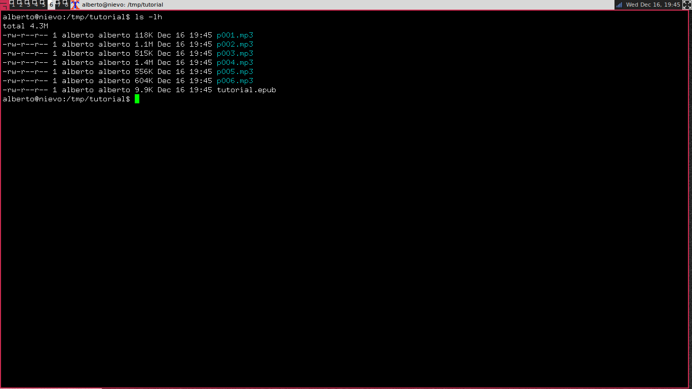

Note that `colophon.xhtml` and `end.xhtml`
do not have associated audio files.


## Step 1: insert the MO attributes

To enable Media Overlays, we must add an `id` attribute to each XHTML element
we want to highlight in sync with the audio.
**icarus** inserts progressive identifiers like `f000001`, `f000002`, etc.

To ease further processing, **icarus** also inserts a `class` attribute,
with default value `mo`,
although this is not required by the EPUB 3 Media Overlays specification.

To insert the MO attributes,
in the Book Browser panel
select the XHTML files
with associated audio
(`p001.xhtml`, ..., `p006.xhtml`):


Open the **icarus** plugin (Plugins > Edit > icarus > Start) and
click on the `Add MO class and id` button
to add the Media Overlays attributes to the selected XHTML pages.


The plugin will modify the selected XHTML files and it will print a report in the log window.


Messages labelled with a `WARN` are warnings,
and they should be examined by the user,
but they do not automatically imply an error.
In our case, all the warnings refer to intentional use
of the `id` or `class="nomo"` attributes,
so we can proceed.


## (OPTIONAL) Step 1 bis: check and/or edit the MO attributes

At this point, you might want to check or modify the MO attributes
generated by **icarus**, by editing the XHTML files in the Sigil Code View.


In the above screenshot you can see that **icarus** added `class="mo"` and `id`
attributes to `<h1>`, `<h2>` and `<p>` elements.


### Ignoring A Specific Element

If you want a specific element to be ignored
(e.g., because its text is not spoken in the audio file),
you can add the "no MO" `class` attribute to it,
whose default value is `nomo`.

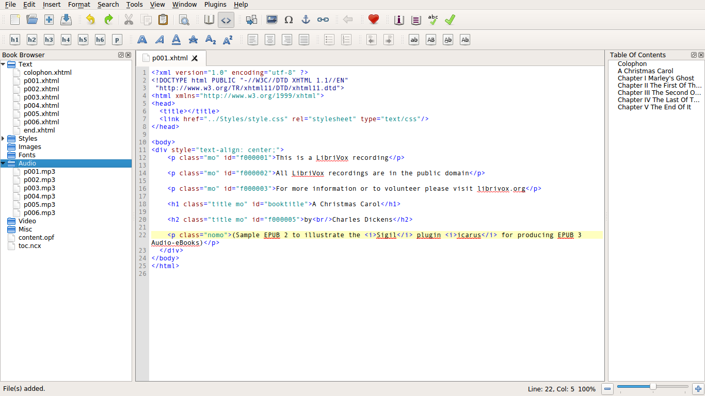

In the above screenshot, the last `<p>` element has `class="nomo"`
and therefore will be ignored by aeneas and it will not appear in the SMIL file.


### Including A Specific Element With A Pre-existing `id` Attribute

If you want to synchronize a specific element which has a pre-existing `id` attribute, you can do so by adding the "MO" `class` attribute to it, whose default value is `mo`.

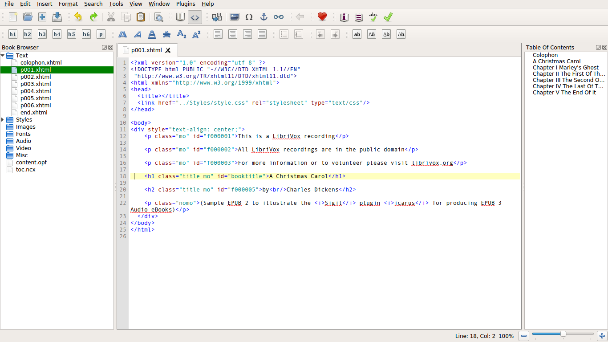

The heading `<h1>` will appear in the SMIL file, with its original `id` attribute with value `booktitle`.


## Step 2: add the audio files

Import the audio files into the `Audio/` directory of your eBook.

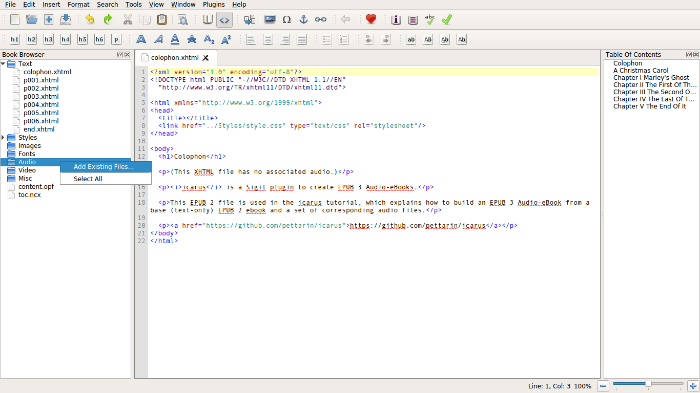

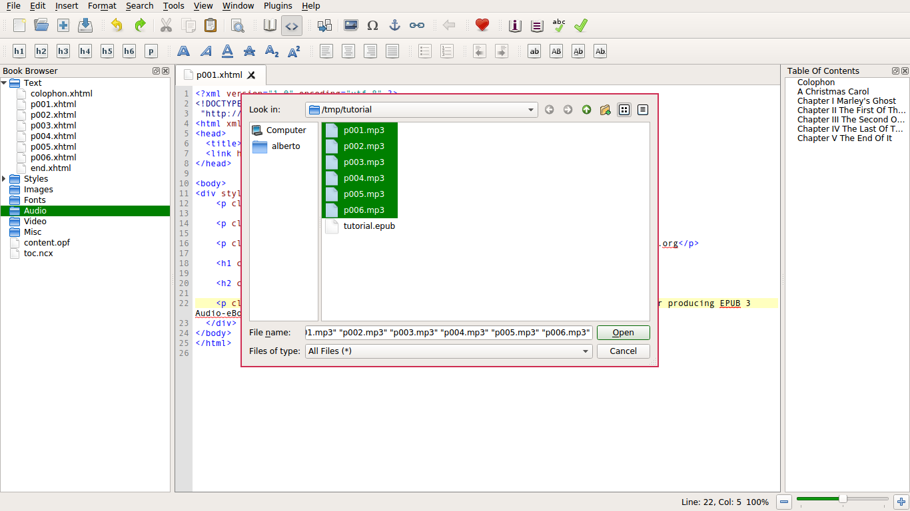

In order to be automatically recognized as a (text, audio) pair,
the XHTML file and the corresponding audio file must have **matchable file names**.
This means:

* equal file names, except for the extension: (`the_whale.xhtml`, `the_whale.mp3`) or (`p001.xhtml`, `p001.mp3`); or
* file names with the same "numeric" part: (`chapter_001.xhtml`, `track_001.mp3`) or (`chapter_001.xhtml`, `track_1.mp3`) or (`chapter_01.xhtml`, `001.mp3`).

**Suggestion**: adopting the first convention and
avoiding using characters not in `[0-9A-Za-z_.]` in your file names
save you headaches. [KISS](https://en.wikipedia.org/wiki/KISS_principle).


## Step 3: generate the aeneas job ZIP file

Open the **icarus** plugin again (Plugins > Edit > icarus > Start).

In the central panel you should see a list of (text, audio) pairs matched automatically.


Note that you can modify this list,
in case some (text, audio) pairs
was not detected properly,
or if you want to delete some pairs.

Once you are satified with the pairs shown in the text box,
click on the `Export aeneas job ZIP file` button
to generate an aeneas job ZIP file (`20151216_195024_aeneas_job.zip`)
in the specified directory:

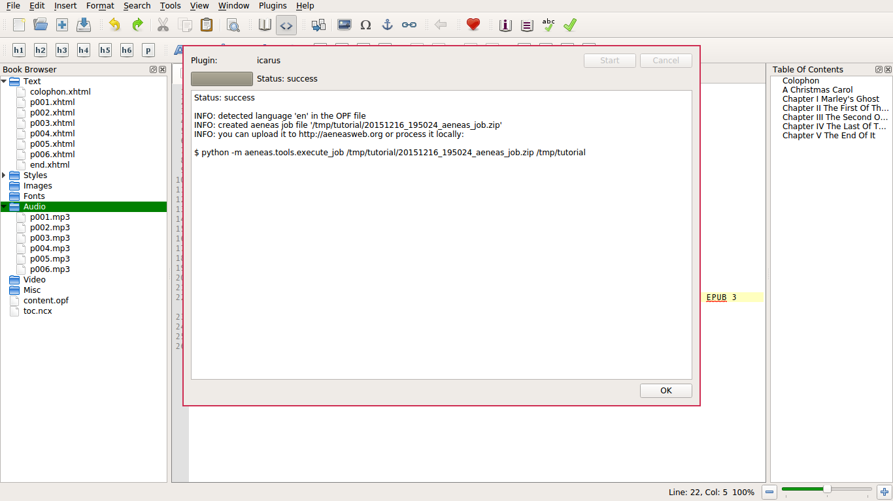

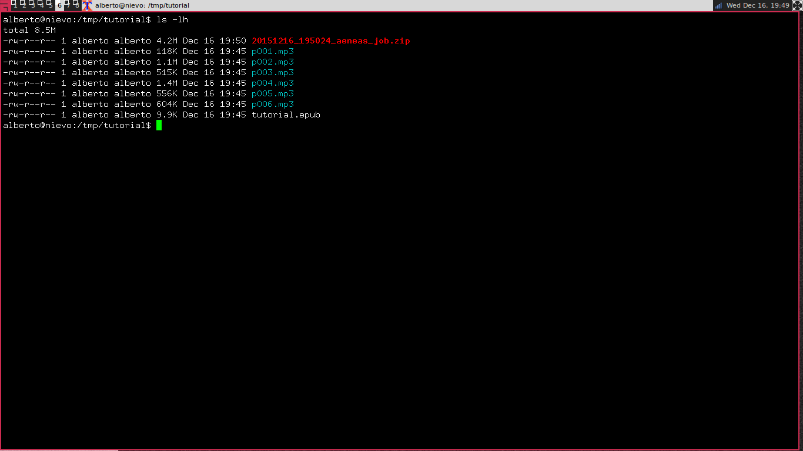


## Step 4: run `aeneas` or upload to `aeneasweb.org`

The ZIP file produced in the previous step
can be directly read by [aeneas](http://www.readbeyond.it/aeneas/)
or uploaded to [aeneasweb.org](http://aeneasweb.org/),
which will compute the synchronization and output the SMIL files
describing the EPUB 3 Media Overlays.

The `config.xml` file inside the ZIP defines a list of aeneas Tasks,
one for each (text, audio) pair of your Audio-eBook,
along with all the parameters requested to compute the corresponding SMIL file.
In our case it contains the following:

```xml
<?xml version = "1.0" encoding="UTF-8" standalone="no"?>
<job>
 <job_language>en</job_language>
 <job_description>Job from Sigil</job_description>
 <os_job_file_name>20151216_195024_aeneas_job.output.zip</os_job_file_name>
 <os_job_file_container>zip</os_job_file_container>
 <os_job_file_hierarchy_type>flat</os_job_file_hierarchy_type>
 <os_job_file_hierarchy_prefix>OEBPS/Misc</os_job_file_hierarchy_prefix>
 <tasks>
  <task>
   <task_language>en</task_language>
   <task_description>Task t000001.xhtml</task_description>
   <task_custom_id>t000001.xhtml</task_custom_id>
   <is_text_file>t000001.xhtml</is_text_file>
   <is_text_type>unparsed</is_text_type>
   <is_text_unparsed_class_regex>mo</is_text_unparsed_class_regex>
   <is_text_unparsed_id_sort>unsorted</is_text_unparsed_id_sort>
   <is_audio_file>a000001.mp3</is_audio_file>
   <os_task_file_name>p001.smil</os_task_file_name>
   <os_task_file_format>smil</os_task_file_format>
   <os_task_file_smil_page_ref>../Text/p001.xhtml</os_task_file_smil_page_ref>
   <os_task_file_smil_audio_ref>../Audio/p001.mp3</os_task_file_smil_audio_ref>
  </task>
  <task>
   <task_language>en</task_language>
   <task_description>Task t000002.xhtml</task_description>
   <task_custom_id>t000002.xhtml</task_custom_id>
   <is_text_file>t000002.xhtml</is_text_file>
   <is_text_type>unparsed</is_text_type>
   <is_text_unparsed_class_regex>mo</is_text_unparsed_class_regex>
   <is_text_unparsed_id_sort>unsorted</is_text_unparsed_id_sort>
   <is_audio_file>a000002.mp3</is_audio_file>
   <os_task_file_name>p002.smil</os_task_file_name>
   <os_task_file_format>smil</os_task_file_format>
   <os_task_file_smil_page_ref>../Text/p002.xhtml</os_task_file_smil_page_ref>
   <os_task_file_smil_audio_ref>../Audio/p002.mp3</os_task_file_smil_audio_ref>
  </task>
  <task>
   <task_language>en</task_language>
   <task_description>Task t000003.xhtml</task_description>
   <task_custom_id>t000003.xhtml</task_custom_id>
   <is_text_file>t000003.xhtml</is_text_file>
   <is_text_type>unparsed</is_text_type>
   <is_text_unparsed_class_regex>mo</is_text_unparsed_class_regex>
   <is_text_unparsed_id_sort>unsorted</is_text_unparsed_id_sort>
   <is_audio_file>a000003.mp3</is_audio_file>
   <os_task_file_name>p003.smil</os_task_file_name>
   <os_task_file_format>smil</os_task_file_format>
   <os_task_file_smil_page_ref>../Text/p003.xhtml</os_task_file_smil_page_ref>
   <os_task_file_smil_audio_ref>../Audio/p003.mp3</os_task_file_smil_audio_ref>
  </task>
  <task>
   <task_language>en</task_language>
   <task_description>Task t000004.xhtml</task_description>
   <task_custom_id>t000004.xhtml</task_custom_id>
   <is_text_file>t000004.xhtml</is_text_file>
   <is_text_type>unparsed</is_text_type>
   <is_text_unparsed_class_regex>mo</is_text_unparsed_class_regex>
   <is_text_unparsed_id_sort>unsorted</is_text_unparsed_id_sort>
   <is_audio_file>a000004.mp3</is_audio_file>
   <os_task_file_name>p004.smil</os_task_file_name>
   <os_task_file_format>smil</os_task_file_format>
   <os_task_file_smil_page_ref>../Text/p004.xhtml</os_task_file_smil_page_ref>
   <os_task_file_smil_audio_ref>../Audio/p004.mp3</os_task_file_smil_audio_ref>
  </task>
  <task>
   <task_language>en</task_language>
   <task_description>Task t000005.xhtml</task_description>
   <task_custom_id>t000005.xhtml</task_custom_id>
   <is_text_file>t000005.xhtml</is_text_file>
   <is_text_type>unparsed</is_text_type>
   <is_text_unparsed_class_regex>mo</is_text_unparsed_class_regex>
   <is_text_unparsed_id_sort>unsorted</is_text_unparsed_id_sort>
   <is_audio_file>a000005.mp3</is_audio_file>
   <os_task_file_name>p005.smil</os_task_file_name>
   <os_task_file_format>smil</os_task_file_format>
   <os_task_file_smil_page_ref>../Text/p005.xhtml</os_task_file_smil_page_ref>
   <os_task_file_smil_audio_ref>../Audio/p005.mp3</os_task_file_smil_audio_ref>
  </task>
  <task>
   <task_language>en</task_language>
   <task_description>Task t000006.xhtml</task_description>
   <task_custom_id>t000006.xhtml</task_custom_id>
   <is_text_file>t000006.xhtml</is_text_file>
   <is_text_type>unparsed</is_text_type>
   <is_text_unparsed_class_regex>mo</is_text_unparsed_class_regex>
   <is_text_unparsed_id_sort>unsorted</is_text_unparsed_id_sort>
   <is_audio_file>a000006.mp3</is_audio_file>
   <os_task_file_name>p006.smil</os_task_file_name>
   <os_task_file_format>smil</os_task_file_format>
   <os_task_file_smil_page_ref>../Text/p006.xhtml</os_task_file_smil_page_ref>
   <os_task_file_smil_audio_ref>../Audio/p006.mp3</os_task_file_smil_audio_ref>
  </task>
 </tasks>
</job>
```

After running `aeneas` or by using `aeneasweb.org`,
you will obtain an output ZIP file (`20151216_195024_aeneas_job.output.zip`),
containing the SMIL files, one for each Task.


## Step 5: import the SMIL files

Open the **icarus** plugin (Plugins > Edit > icarus > Start) a third time.

In the bottom panel click on the `Import SMIL files` button:


You will be asked to select the ZIP file produced in the previous step (`20151216_195024_aeneas_job.output.zip`):

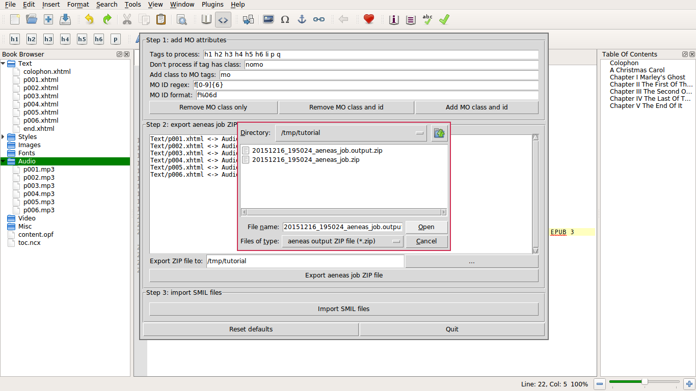

and the SMIL files it contains will be added to your eBook.


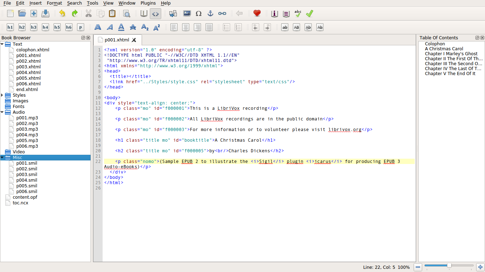

Note that you can also import each SMIL file separately,
instead of batch importing from a ZIP file.


## (OPTIONAL) Step 5 bis: define a CSS MO class

The `ePub3-itizer` plugin will set the following `meta` in the OPF
of the exported EPUB 3 file:

```xml
<meta property="media:active-class">-epub-media-overlay-active</meta>
<meta property="media:playback-active-class">-epub-media-overlay-playback-active</meta>
```

Hence, you want to define (at least the first of)
the two above class rules in the CSS of your eBook.

For example, to have a yellow highlight when MO playback is active,
insert this rule in your CSS:

```css
.-epub-media-overlay-active {
    background-color: #FFFF00;
}
```

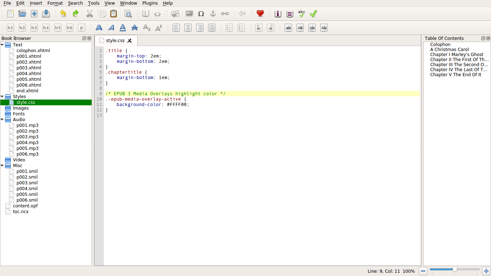


## Step 6: export your EPUB 3 Audio-eBook

At this point you have an EPUB 2 eBook with audio files and SMIL files,
since Sigil is not yet capable of handling EPUB 3 file natively.

You can export this "augmented" EPUB 2 eBook as a fully valid 
EPUB 3 Audio-eBook by using the `ePub3-itizer` plugin (Plugins > Output > ePub3-itizer),
version v0.3.4 or later.

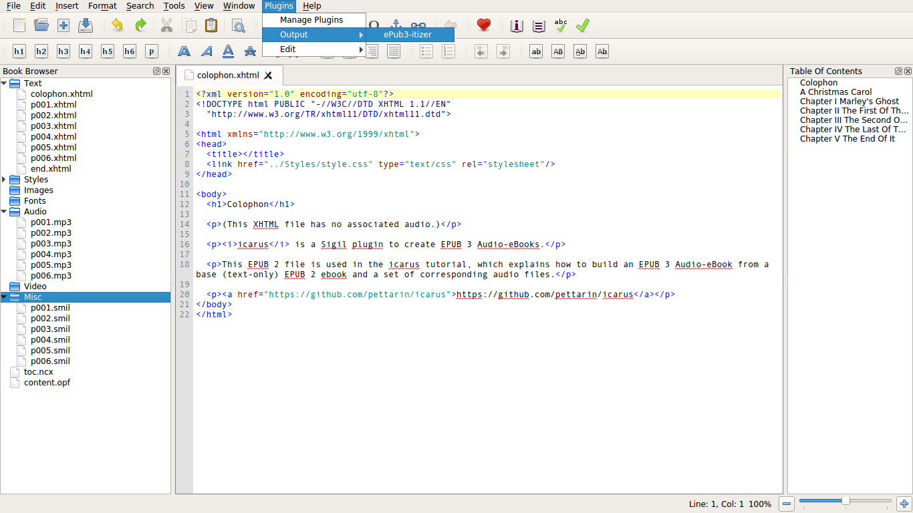

You will be asked to select a destination for your EPUB 3 eBook,
and you will get a log of the export operation:


In our case, we obtained a file named `icarus_tutorial_epub3.epub`:


## Step 7: validate, test, and enjoy

Do not forget to validate your EPUB 3 file,
to be sure it does not contain any errors that might cause problems
to reading applications.

**Suggestion**: use [epubcheck](https://github.com/idpf/epubcheck) on the command line:

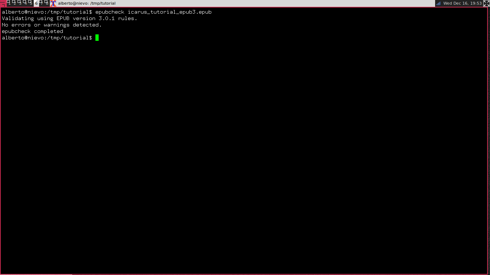

As you can see, our EPUB 3 file is valid and no errors are found.

Finally, test it in an app that supports EPUB 3 Media Overlays,
like [Menestrello](http://www.readbeyond.it/menestrello/) (Android, iOS) or Readium (PC, Mac):

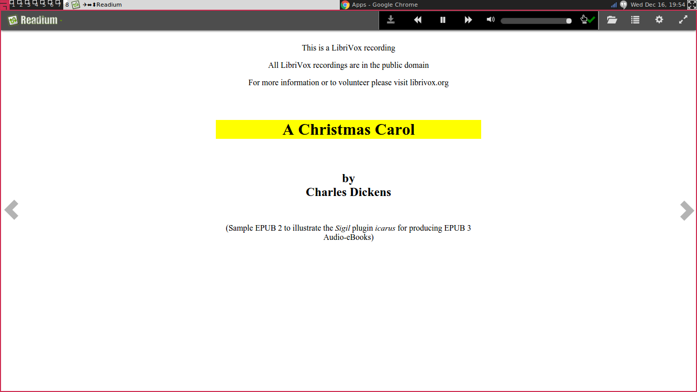

**Congratulations, you have just created your first EPUB 3 Audio-eBook!**


